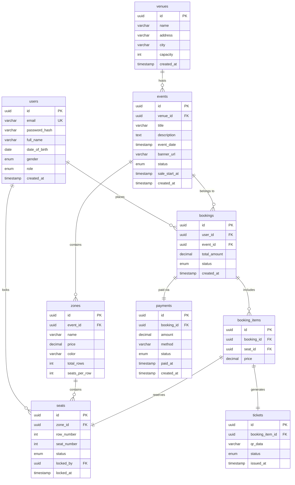
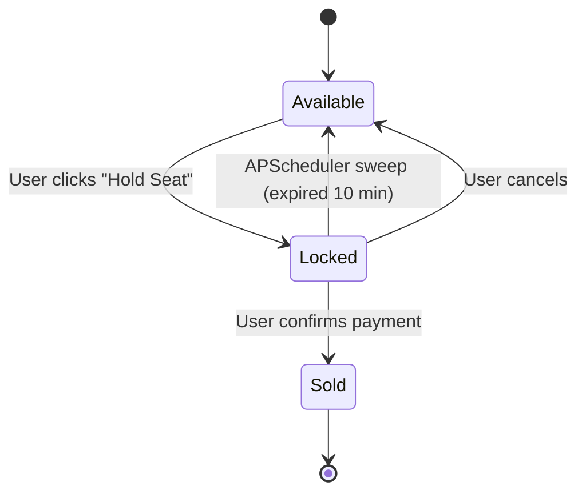
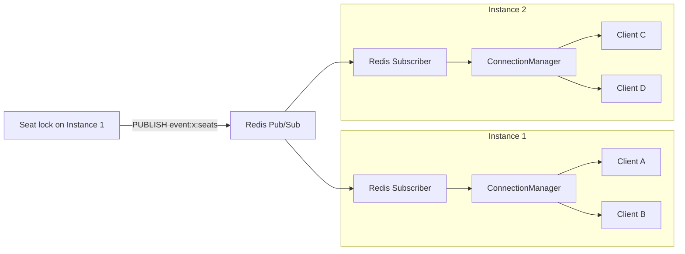
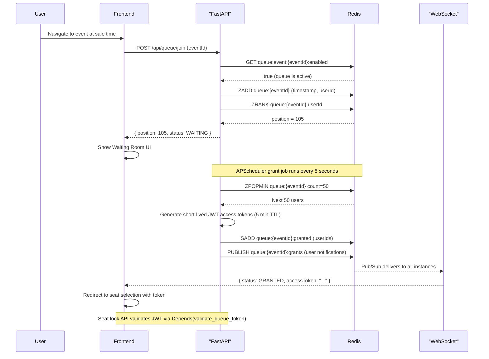
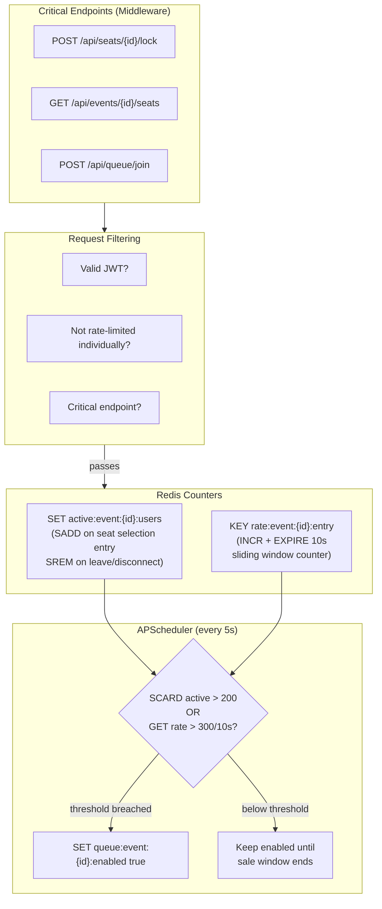

# TicketRush -- Implementation Plan

---

## 1. Proposed Tech Stack

### Frontend (React + TypeScript)

- **React 19 + TypeScript + Vite** -- Component-based SPA satisfying "no page reloads" criterion. Vite provides fast HMR and optimized builds.
- **Tailwind CSS v4** -- Utility-first styling for rapid, responsive, modern UI (addresses UI/UX criterion, weight 0.20).
- **React Router v7** -- Client-side routing with nested layouts, loaders, URL rewriting (addresses Routing criterion, weight 0.05).
- **Zustand** -- Lightweight state management; minimal boilerplate vs Redux.
- **TanStack Query (React Query)** -- Server state caching, background refetching; pairs with Fetch API for the Performance criterion.
- **Konva.js (react-konva)** -- High-performance 2D canvas for interactive seat grids with hit detection, zoom, pan.
- **reconnecting-websocket** (npm) -- Thin wrapper over native `WebSocket` API adding auto-reconnect with exponential backoff. Connects to FastAPI's native WebSocket endpoints.
- **Recharts** -- Charting library for admin dashboard (revenue, demographics).

### Backend (FastAPI + Python)

- **FastAPI + Uvicorn (Python 3.12+)** -- ASGI async framework. Native `async/await`, automatic OpenAPI/Swagger docs, Pydantic validation built-in. High concurrency via async I/O -- ideal for flash-sale seat locking workloads.
- **SQLAlchemy 2.0 (async) + Alembic** -- OOP declarative models (`DeclarativeBase`), async sessions (`AsyncSession`), repository pattern. Database-independent (change connection string for PostgreSQL/MySQL/SQLite). Alembic handles migrations. Satisfies "OOP-based database interaction and database independence" criterion.
- **PostgreSQL** -- ACID transactions, `SELECT ... FOR UPDATE NOWAIT` row-level locking -- critical for the concurrency requirement. `NOWAIT` fails immediately if the row is locked by another transaction, preventing async event loop blocking.
- **Redis (redis.asyncio)** -- In-memory store for: (1) distributed locks for seat contention (`SET NX`), (2) Pub/Sub message bus for cross-instance WebSocket broadcast, (3) virtual queue sorted sets + grant sets, (4) queue activation signals (active user SETs + request rate counters), (5) scheduler dedup locks.
- **APScheduler (AsyncIOScheduler)** -- Lightweight in-process scheduler. Runs periodic sweep jobs: expired seat release (every 15s) and queue batch grant (every 5s). Uses Redis lock to prevent duplicate execution across multiple app instances. Simpler than Celery/arq -- no separate worker process needed.
- **FastAPI native WebSocket + Redis Pub/Sub** -- Built-in WebSocket via Starlette. Each instance manages local connections in a `dict[event_id, set[WebSocket]]`. Cross-instance broadcast via Redis Pub/Sub channels (`event:{id}:seats`). Frontend uses `reconnecting-websocket` for auto-reconnect.
- **passlib[bcrypt] + python-jose** -- `passlib` for password hashing, `python-jose` for JWT encode/decode. FastAPI's official auth pattern.
- **qrcode** (Python) -- Generates QR code PNG/data-URL for e-tickets.
- **Pydantic v2** -- Request/response validation and serialization (bundled with FastAPI).

### DevOps / Tooling

- **Docker Compose** -- Local dev environment for PostgreSQL + Redis.
- **pnpm** -- Frontend package management.
- **uv** -- Fast Python package manager and virtualenv. `pyproject.toml` + `uv.lock` for reproducible installs.
- **Ruff** -- Python linter + formatter (replaces flake8 + black + isort).
- **ESLint + Prettier** -- Frontend code quality.

---

## 2. Project Architecture

### 2.1 Project Structure

```
ticket-rush/
├── README.md
├── ops/
│   ├── docker/...
│   ├── k8s/...
├── frontend/                              # React SPA (TypeScript)
│   ├── package.json
│   ├── vite.config.ts
│   ├── public/
│   └── src/
│       ├── components/
│       │   ├── ui/                      # Button, Modal, Input, Card, Badge, etc.
│       │   ├── layout/                  # AppShell, Sidebar, Navbar, Footer
│       │   ├── seating/                 # SeatMap, SeatNode, ZoneLegend
│       │   └── queue/                   # WaitingRoom, QueuePosition
│       ├── pages/
│       │   ├── public/                  # HomePage, EventListPage, EventDetailPage
│       │   ├── auth/                    # LoginPage, RegisterPage
│       │   ├── booking/                 # SeatSelectionPage, CheckoutPage, ConfirmationPage
│       │   ├── customer/                # MyTicketsPage, TicketDetailPage
│       │   └── admin/                   # DashboardPage, EventManagerPage, SeatEditorPage
│       ├── hooks/                       # useAuth, useWebSocket, useQueue, useSeats
│       ├── services/                    # api.ts (fetch wrappers), ws.ts (WebSocket manager)
│       ├── store/                       # authStore, seatStore, queueStore (Zustand)
│       ├── types/                       # TypeScript interfaces matching Pydantic schemas
│       └── utils/                       # formatters, validators, constants
│
├── backend/                              # FastAPI Backend (Python)
│   ├── pyproject.toml                   # Dependencies (uv / pip)
│   ├── alembic.ini
│   ├── alembic/
│   │   └── versions/                    # Migration scripts
│   └── app/
│       ├── main.py                      # FastAPI app factory, CORS, lifespan events
│       ├── config.py                    # Settings via pydantic-settings (env vars)
│       ├── database.py                  # AsyncEngine, async_sessionmaker, get_db dependency
│       ├── redis.py                     # Redis connection pool (redis.asyncio)
│       ├── models/                      # SQLAlchemy ORM models
│       │   ├── base.py                  # DeclarativeBase, common mixins (TimestampMixin)
│       │   ├── user.py                  # User model
│       │   ├── venue.py                 # Venue model (name, address, city, capacity)
│       │   ├── event.py                 # Event model (venue_id FK)
│       │   ├── zone.py                  # Zone model
│       │   ├── seat.py                  # Seat model (status enum, locked_by, locked_at)
│       │   ├── booking.py               # Booking + BookingItem models
│       │   ├── payment.py               # Payment model (booking_id FK, amount, status)
│       │   └── ticket.py                # Ticket model
│       ├── schemas/                     # Pydantic request/response schemas
│       │   ├── auth.py
│       │   ├── user.py
│       │   ├── event.py
│       │   ├── zone.py
│       │   ├── seat.py
│       │   ├── booking.py
│       │   ├── payment.py
│       │   ├── ticket.py
│       │   └── queue.py                 # Queue join/status request/response (no DB model)
│       ├── routers/                     # FastAPI APIRouters (thin controllers)
│       │   ├── auth.py
│       │   ├── venues.py
│       │   ├── events.py
│       │   ├── zones.py
│       │   ├── seats.py
│       │   ├── bookings.py
│       │   ├── payments.py
│       │   ├── tickets.py
│       │   ├── queue.py
│       │   └── dashboard.py
│       ├── services/                    # Business logic layer (OOP service classes)
│       │   ├── auth_service.py
│       │   ├── event_service.py
│       │   ├── seat_service.py          # Two-layer locking (Redis + PG NOWAIT)
│       │   ├── booking_service.py
│       │   ├── payment_service.py       # Simulated payment, creates payment record
│       │   ├── ticket_service.py        # QR code generation
│       │   ├── queue_service.py         # Redis virtual queue + dual-signal activation
│       │   └── dashboard_service.py     # Analytics queries (revenue from payments table)
│       ├── ws/                          # WebSocket endpoints
│       │   ├── manager.py               # ConnectionManager (local rooms + Redis Pub/Sub)
│       │   ├── pubsub.py                # Redis Pub/Sub listener (subscribe channels, dispatch to local WS)
│       │   └── seats_ws.py              # /ws/events/{event_id}/seats endpoint
│       ├── scheduler/                   # APScheduler periodic jobs
│       │   ├── setup.py                 # AsyncIOScheduler init, attach to FastAPI lifespan
│       │   ├── seat_release_job.py      # Sweep expired seats every 15s (with Redis lock)
│       │   ├── queue_grant_job.py       # Grant queue batches every 5s (with Redis lock)
│       │   └── queue_activation_job.py  # Dual-signal queue activation check every 5s
│       ├── dependencies/                # FastAPI Depends() helpers
│       │   ├── auth.py                  # get_current_user, require_admin
│       │   └── queue_access.py          # validate_queue_token
│       └── utils/
│           ├── security.py              # JWT encode/decode, password hash/verify
│           └── enums.py                 # SeatStatus, BookingStatus, etc.
```

**Key architectural pattern**: Router (thin) -> Service (business logic) -> Model/DB (data access). This 3-layer separation satisfies the "separation of UI and Business Logic" and "design patterns" criteria.The code architecture above is just a demo; it may not include all the  files.

### 2.2 System Overview Diagram

```mermaid
flowchart TB
    subgraph frontend ["Frontend (React SPA)"]
        ReactApp["React + Vite"]
        Konva["react-konva (Seat Map)"]
        WS_Client["reconnecting-websocket"]
    end

    subgraph inst1 ["FastAPI Instance 1"]
        Routers1["APIRouters"]
        Services1["Service Layer"]
        WS_Hub1["WebSocket Hub"]
        Scheduler1["APScheduler"]
    end

    subgraph inst2 ["FastAPI Instance N"]
        Routers2["APIRouters"]
        Services2["Service Layer"]
        WS_Hub2["WebSocket Hub"]
    end

    subgraph datastores ["Data Stores"]
        PG["PostgreSQL"]
        RD["Redis\n(Lock + Pub/Sub + Queue)"]
    end

    ReactApp -->|"REST API (Fetch)"| Routers1
    WS_Client <-->|"Native WebSocket"| WS_Hub1
    WS_Client <-->|"Native WebSocket"| WS_Hub2
    Routers1 --> Services1
    Services1 -->|"Layer 2: FOR UPDATE NOWAIT"| PG
    Services1 -->|"Layer 1: SET NX (dist lock)"| RD
    Services1 -->|"PUBLISH seat update"| RD
    RD -->|"SUBSCRIBE"| WS_Hub1
    RD -->|"SUBSCRIBE"| WS_Hub2
    Scheduler1 -->|"sweep expired seats"| PG
    Scheduler1 -->|"Redis lock (dedup)"| RD
    Konva --> WS_Client
```




### 2.3 Database Schema (ERD)




**Seat status enum**: `AVAILABLE`, `LOCKED`, `SOLD`

**Booking status enum**: `PENDING`, `CONFIRMED`, `EXPIRED`, `CANCELLED`

**Payment status enum**: `PENDING`, `COMPLETED`, `FAILED`

**Ticket status enum**: `VALID`, `USED`, `CANCELLED`

**Virtual queue** is fully Redis-based (no DB table). Access tokens are short-lived JWTs (5-min TTL). Redis keys:

- `queue:{eventId}` -- sorted set (position tracking)
- `queue:{eventId}:granted` -- set (active access grants)
- `active:event:{eventId}:users` -- set (users in seat selection)
- `rate:event:{eventId}:entry` -- counter with TTL (request rate signal)
- `queue:event:{eventId}:enabled` -- flag (queue on/off)

---

## 3. Core Feature Architecture

### 3.1 Interactive Seating Map

```mermaid
sequenceDiagram
    participant Browser
    participant ReactKonva as "react-konva Canvas"
    participant API as "FastAPI Instance"
    participant Redis
    participant WS_Hub as "All WS Hubs (via Pub/Sub)"
    participant DB as "PostgreSQL"

    Browser->>API: GET /api/events/{id}/seats
    API->>DB: Query all seats for event (async)
    DB-->>API: Seat rows with statuses
    API-->>Browser: JSON seat array
    Browser->>ReactKonva: Render seat grid on canvas

    Note over Browser,WS_Hub: Client opens WebSocket
    Browser->>WS_Hub: connect /ws/events/{id}/seats

    Note over Browser: User clicks seat VIP-A1
    Browser->>API: POST /api/seats/{id}/lock
    API->>Redis: SET seat:{id}:lock NX EX 5 (Layer 1)
    Redis-->>API: OK (acquired) or nil (fail fast)
    API->>DB: BEGIN; SELECT ... FOR UPDATE NOWAIT (Layer 2)
    DB-->>API: Row locked
    API->>DB: UPDATE status=LOCKED; COMMIT
    API->>Redis: DEL seat:{id}:lock
    API-->>Browser: 200 OK
    API->>Redis: PUBLISH event:{id}:seats (seat update)
    Redis-->>WS_Hub: All subscribed instances receive
    WS_Hub-->>Browser: All clients see seat turn gray
```


**Admin Seat Matrix Editor**: Admin defines zones with rows/columns. Backend generates individual `seat` rows in bulk. Admin visually adjusts zones on a Konva canvas and assigns names/prices/colors.

**Canvas rendering strategy**: Each seat is a `Rect` or `Circle` on a Konva `Layer`. Color = status: green (available), amber (your selection), gray (locked by others), red (sold). Stage supports zoom (scroll wheel) and pan (drag) for large venues.

### 3.2 Concurrency Control -- Two-Layer Locking

This is the most critical piece. Two layers protect against race conditions while minimizing database load:

**Layer 1 -- Redis Distributed Lock** (fast filter, sub-millisecond):

```python
# Pseudocode: acquire Redis lock
lock_key = f"seat:{seat_id}:lock"
acquired = await redis.set(lock_key, str(user_id), nx=True, ex=5)
if not acquired:
    raise HTTPException(409, "Seat is being contested")
```

- `SET NX EX 5` is atomic. During a flash sale with 1000 concurrent clicks on the same seat, 999 are rejected at Redis in microseconds. Only 1 hits the database.
- The 5-second TTL is a safety net: if the app crashes after acquiring the lock, it auto-expires.

**Layer 2 -- PostgreSQL FOR UPDATE NOWAIT** (data consistency guarantee):

```python
# server/app/services/seat_service.py (pseudocode)
class SeatService:
    async def lock_seat(self, seat_id: UUID, user_id: UUID,
                        db: AsyncSession, redis: Redis):
        lock_key = f"seat:{seat_id}:lock"
        if not await redis.set(lock_key, str(user_id), nx=True, ex=5):
            raise HTTPException(409, "Seat is being contested")
        try:
            async with db.begin():
                result = await db.execute(
                    select(Seat)
                    .where(Seat.id == seat_id)
                    .with_for_update(nowait=True)  # NOWAIT: fail fast
                )
                seat = result.scalar_one_or_none()
                if seat is None or seat.status != SeatStatus.AVAILABLE:
                    raise HTTPException(409, "Seat unavailable")

                seat.status = SeatStatus.LOCKED
                seat.locked_by = user_id
                seat.locked_at = datetime.utcnow()
                db.add(seat)

            # Publish to Redis Pub/Sub for cross-instance broadcast
            await redis.publish(
                f"event:{seat.zone.event_id}:seats",
                json.dumps({"seat_id": str(seat_id), "status": "LOCKED"})
            )
            return seat
        finally:
            await redis.delete(lock_key)
```

- `with_for_update(nowait=True)` maps to `SELECT ... FOR UPDATE NOWAIT` -- if another transaction somehow holds the row (e.g., Redis lock TTL expired early), PostgreSQL raises `LockNotAvailable` immediately instead of blocking the async event loop.
- This is a **safety net**, not the primary contention handler. Redis Layer 1 handles 99.9% of contention.
- The frontend handles 409 gracefully with a toast and seat color update via WebSocket.

### 3.3 Ticket Lifecycle and APScheduler Sweep




**APScheduler periodic sweep** (every 15 seconds):

```python
# server/app/scheduler/seat_release_job.py (pseudocode)
async def sweep_expired_seats():
    # Redis lock prevents multiple instances from running concurrently
    if not await redis.set("lock:sweep_seats", "1", nx=True, ex=14):
        return  # another instance is already sweeping

    try:
        async with async_session() as db:
            cutoff = datetime.utcnow() - timedelta(minutes=10)
            result = await db.execute(
                select(Seat)
                .where(Seat.status == SeatStatus.LOCKED)
                .where(Seat.locked_at < cutoff)
            )
            expired_seats = result.scalars().all()

            for seat in expired_seats:
                seat.status = SeatStatus.AVAILABLE
                seat.locked_by = None
                seat.locked_at = None
                # Also update associated booking -> EXPIRED

            await db.commit()

            # Publish updates via Redis Pub/Sub
            for seat in expired_seats:
                await redis.publish(
                    f"event:{seat.zone.event_id}:seats",
                    json.dumps({"seat_id": str(seat.id), "status": "AVAILABLE"})
                )
    finally:
        await redis.delete("lock:sweep_seats")
```

- Runs every 15 seconds inside each FastAPI instance via APScheduler `AsyncIOScheduler`
- Redis `SET NX EX 14` ensures only one instance executes per cycle (lock TTL < interval = safe)
- Timing imprecision is at most ±15 seconds on a 10-minute window -- entirely acceptable
- No separate worker process needed; scheduler starts in `FastAPI.lifespan`

**Scheduler setup in lifespan**:

```python
# server/app/scheduler/setup.py (pseudocode)
from apscheduler.schedulers.asyncio import AsyncIOScheduler

scheduler = AsyncIOScheduler()

async def start_scheduler():
    scheduler.add_job(sweep_expired_seats, "interval", seconds=15)
    scheduler.add_job(grant_queue_batch, "interval", seconds=5)
    scheduler.add_job(check_queue_activation, "interval", seconds=5)
    scheduler.start()
```

### 3.4 WebSocket: Redis Pub/Sub Cross-Instance Broadcast

The WebSocket layer is designed for multi-instance deployment. Each instance manages its own local connections, while Redis Pub/Sub synchronizes updates across all instances.




**ConnectionManager** (local room management):

```python
# server/app/ws/manager.py (pseudocode)
class ConnectionManager:
    def __init__(self):
        self.rooms: dict[str, set[WebSocket]] = defaultdict(set)

    async def connect(self, event_id: str, ws: WebSocket):
        await ws.accept()
        self.rooms[event_id].add(ws)

    async def disconnect(self, event_id: str, ws: WebSocket):
        self.rooms[event_id].discard(ws)

    async def broadcast_local(self, event_id: str, message: dict):
        for ws in list(self.rooms.get(event_id, [])):
            try:
                await ws.send_json(message)
            except WebSocketDisconnect:
                self.rooms[event_id].discard(ws)
```

**Redis Pub/Sub Listener** (runs as background asyncio task in lifespan):

```python
# server/app/ws/pubsub.py (pseudocode)
async def pubsub_listener(redis: Redis, manager: ConnectionManager):
    pubsub = redis.pubsub()
    # Subscribe to all event seat channels via pattern
    await pubsub.psubscribe("event:*:seats")
    async for message in pubsub.listen():
        if message["type"] == "pmessage":
            event_id = message["channel"].split(":")[1]
            data = json.loads(message["data"])
            await manager.broadcast_local(event_id, data)
```

**Frontend** connects with `reconnecting-websocket`:

```typescript
// client/src/hooks/useWebSocket.ts (pseudocode)
const ws = new ReconnectingWebSocket(`ws://host/ws/events/${eventId}/seats`);
ws.onmessage = (msg) => {
  const update = JSON.parse(msg.data);
  seatStore.updateSeat(update.seatId, update.status);
};
```

### 3.5 Virtual Queue System (Fully Redis-Based)

No DB table needed. Queue state lives entirely in Redis with JWT access tokens.




**Redis data structures**:

- `queue:{eventId}` -- sorted set (score = join timestamp, member = userId). `ZRANK` returns position, `ZPOPMIN` dequeues batches.
- `queue:{eventId}:granted` -- set of userIds currently granted access, enforces concurrency cap.
- Access tokens are short-lived JWTs (5-min TTL). No persistence needed -- validated stateless by `Depends(validate_queue_token)`.

**Queue batch granting** (APScheduler, every 5 seconds):

- `grant_queue_batch()` acquires Redis lock `lock:queue_grant`, pops next N users via `ZPOPMIN`, generates JWT tokens, adds to `granted` set, and publishes grant via Redis Pub/Sub.

#### Dual-Signal Queue Auto-Activation

The queue activates based on **actual user behavior**, not passive connections:




**Signal 1 -- Active users in seat selection** (`active:event:{id}:users`):

- `SADD` when authenticated user enters seat selection page (GET `/api/events/{id}/seats`)
- `SREM` when user disconnects WebSocket or leaves
- `SCARD` returns count of genuinely active users

**Signal 2 -- Request rate to critical endpoints** (`rate:event:{id}:entry`):

- Middleware on critical endpoints (`/seats/lock`, `/events/{id}/seats`, `/queue/join`) increments counter
- Uses `INCR` + `EXPIRE 10` for a 10-second sliding window
- Only counts requests with valid JWT and not individually rate-limited

**Why dual-signal is better than counting WebSocket connections**:

- Idle tabs, reconnects, spectators all create WS connections but don't represent buying intent
- Signal 1 measures **who is actually in seat selection**
- Signal 2 measures **incoming pressure** (new users arriving)
- Either signal alone can trigger the queue -- prevents both sudden spikes and sustained high load

**Activation behavior**:

- Once enabled, the queue stays active until the sale window ends (no flapping on/off)
- Users already in seat selection are not ejected; only new arrivals join the queue
- The `check_queue_activation()` APScheduler job runs every 5 seconds with a Redis dedup lock

### 3.6 Authentication and Authorization

- **Registration/Login** with email + password (`passlib[bcrypt]` hashing)
- **JWT access token** (15 min, in response body) + **refresh token** (7 days, in HTTP-only cookie)
- **Role-based access** via FastAPI dependency injection:

```python
# server/app/dependencies/auth.py (pseudocode)
async def get_current_user(token: str = Depends(oauth2_scheme), db = Depends(get_db)) -> User:
    payload = decode_jwt(token)
    user = await db.get(User, payload["sub"])
    if not user:
        raise HTTPException(401)
    return user

async def require_admin(user: User = Depends(get_current_user)) -> User:
    if user.role != Role.ADMIN:
        raise HTTPException(403)
    return user
```

- Admin routes use `Depends(require_admin)`; customer routes use `Depends(get_current_user)`
- Admin accounts are seeded; no public admin registration

### 3.7 Admin Dashboard and Analytics

- **Revenue chart**: Line/bar chart of daily revenue via `GET /api/dashboard/revenue` (SQLAlchemy aggregate query on `payments` table, grouped by date, filtered by `status = COMPLETED`)
- **Seat occupancy**: Real-time sold/locked/available counts per zone, pushed via WebSocket to admin dashboard
- **Audience demographics**: Pie/bar charts of age brackets and gender distribution, from `users JOIN bookings` query
- Frontend: **Recharts** library for all charts

---

## 4. API Route Design

```
Auth
  POST   /api/auth/register
  POST   /api/auth/login
  POST   /api/auth/refresh
  POST   /api/auth/logout

Venues
  GET    /api/venues                        # list all venues
  GET    /api/venues/{id}                   # venue detail
  POST   /api/venues             [admin]    # create venue
  PATCH  /api/venues/{id}        [admin]    # update venue
  DELETE /api/venues/{id}        [admin]    # delete venue

Events
  GET    /api/events                        # list (public, search/filter)
  GET    /api/events/{id}                   # detail (public, includes venue info)
  POST   /api/events            [admin]     # create (with venue_id)
  PATCH  /api/events/{id}       [admin]     # update
  DELETE /api/events/{id}       [admin]     # delete

Zones & Seats
  GET    /api/events/{id}/zones             # zones with seat counts
  POST   /api/events/{id}/zones  [admin]    # create zone (bulk seat generation)
  GET    /api/events/{id}/seats             # all seats with statuses
  POST   /api/seats/{id}/lock    [customer] # lock seat (requires queue token if active)
  POST   /api/seats/{id}/unlock  [customer] # release seat

Bookings
  POST   /api/bookings                      # create booking from locked seats
  GET    /api/bookings/my                   # customer's bookings
  GET    /api/bookings/{id}                 # booking detail

Payments
  POST   /api/bookings/{id}/pay             # simulate payment (creates payment record)
  GET    /api/payments/{id}                 # payment detail

Tickets
  GET    /api/tickets/my                    # customer's tickets
  GET    /api/tickets/{id}                  # ticket detail with QR

Queue
  POST   /api/queue/join                    # join virtual queue
  GET    /api/queue/status                  # current queue position

Dashboard (Admin)
  GET    /api/dashboard/revenue             # revenue over time
  GET    /api/dashboard/occupancy           # seat occupancy per event
  GET    /api/dashboard/demographics        # age + gender breakdown

WebSocket
  WS     /ws/events/{id}/seats              # real-time seat status updates
  WS     /ws/queue/{event_id}               # queue position updates + grant notifications
```

---

## 5. Key UI Pages

- **Home / Event Listing** (Public) -- Hero banner, search bar, event cards grid with filters
- **Event Detail** (Public) -- Banner, description, date, venue, zone pricing, "Book Now" CTA
- **Login / Register** (Public) -- Auth forms with validation
- **Waiting Room** (Customer) -- Queue position counter, animated progress, "do not refresh" notice
- **Seat Selection** (Customer) -- Full-screen Konva canvas, zone legend, selection sidebar with running total
- **Checkout** (Customer) -- Order summary, seat details, 10-min countdown timer, "Confirm Payment" button
- **Confirmation** (Customer) -- Success message, booking summary
- **My Tickets** (Customer) -- List of bookings, expandable ticket cards with QR codes
- **Admin Dashboard** (Admin) -- Revenue chart, occupancy heatmap, demographic charts, recent bookings table
- **Event Manager** (Admin) -- CRUD table for events, inline status toggle (draft/published/ended)
- **Seat Matrix Editor** (Admin) -- Konva canvas editor to define zones, rows, and seat layout visually

---

## 6. Implementation Phases

The implementation is divided into 5 phases, ordered by dependency and priority.